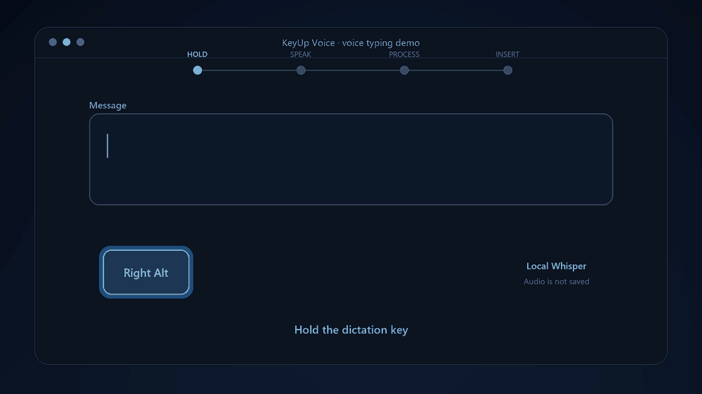

# KeyUp Voice

[English version](README.md)

## [⬇ Скачать KeyUp Voice для Windows](https://github.com/LexGilden/KeyUp-Voice/releases)

Последняя стабильная версия для Windows 11 x64.


KeyUp Voice — локальное приложение голосового ввода для Windows 11. Удерживайте
назначенную клавишу, говорите и отпустите её, чтобы вставить распознанный текст
в активное текстовое поле.



Распознавание выполняется локально с помощью
[faster-whisper](https://github.com/SYSTRAN/faster-whisper). Отдельная клавиша
может сразу переводить речь на английский через встроенный режим Whisper.

## Возможности

- Голосовой ввод в приложениях, поддерживающих вставку текста.
- Отдельные клавиши, сочетания или боковые кнопки мыши для диктовки и перевода
  на английский (`Ctrl+Space`, Alt с клавишей Ё/тильды, Mouse 4/5 и другие).
- `Esc` отменяет текущую запись без распознавания и вставки.
- Отмена последней вставки через меню значка в трее.
- Современный индикатор микрофона с семью вариантами анимации.
- Пять мультиязычных моделей Whisper с выбором при первом запуске и в настройках.
- Просмотр занятого моделями места и удаление неиспользуемых моделей.
- Автоматическое определение NVIDIA и ускорение через CUDA.
- Работа через CPU на AMD, Intel и компьютерах без поддерживаемой NVIDIA.
- Русский и английский интерфейс программы и установщика.
- Настраиваемый автозапуск Windows.
- Продолжение прерванной загрузки и проверка файлов по SHA-256.
- Голосовые записи не сохраняются: звук обрабатывается только в памяти.

## Скачивание и установка

1. Откройте раздел **[Releases](https://github.com/LexGilden/KeyUp-Voice/releases)** репозитория.
2. Скачайте `KeyUp-Voice-Setup-<версия>.exe`.
3. Выберите русский или английский язык установщика.
4. Запустите KeyUp Voice и выберите модель Whisper.
5. При необходимости разрешите загрузку модели и библиотек NVIDIA CUDA.

Установщик намеренно не содержит Whisper и CUDA. После загрузки компонентов
распознавание работает без подключения к интернету.

## Использование

1. Поставьте курсор в текстовое поле.
2. Удерживайте клавишу диктовки и говорите.
3. Отпустите клавишу.
4. KeyUp Voice распознает речь и вставит результат.

Клавиши по умолчанию:

| Действие | Клавиша |
| --- | --- |
| Диктовка | Правый Alt |
| Перевод речи на английский | Правый Ctrl |

Обе клавиши изменяются в **Настройках** через меню значка в системном трее.
Нажмите на поле назначения и затем нажмите нужную клавишу, сочетание или боковую
кнопку мыши. Во время записи `Esc` отменяет диктовку. Пункт отмены последней
вставки находится в меню значка в трее.

## Модели Whisper

| Модель | Примерный размер | Назначение |
| --- | ---: | --- |
| Tiny | 75 МБ | Минимальный размер и самая быстрая работа на CPU |
| Base | 141 МБ | Лёгкий вариант для повседневного использования |
| Small | 464 МБ | Более высокая точность при умеренной нагрузке |
| Medium | 1,4 ГБ | Рекомендуемый баланс качества и скорости |
| Large-v3 | 2,9 ГБ | Максимальная доступная точность |

Модели хранятся отдельно. Переключение на установленную модель не требует
повторной загрузки, а отсутствующая скачивается после сохранения выбора.
В **Настройки → Управление моделями** отображается фактически занятое место;
там же можно удалить любую неактивную модель или незавершённую загрузку.

Файлы берутся из официальной
[коллекции Systran faster-whisper](https://huggingface.co/collections/Systran/faster-whisper)
и закреплены на конкретных ревизиях.

## Обработка на GPU и CPU

- **NVIDIA:** приложение может скачать библиотеки CUDA 12 и использовать
  вычисления `float16`.
- **AMD / Intel / без совместимой видеокарты:** используется CPU и режим `int8`.

CUDA загружается из официальных пакетов NVIDIA на PyPI.

## Конфиденциальность

- Распознавание и перевод выполняются локально.
- Запись хранится в оперативной памяти только во время текущей диктовки.
- После обработки звук удаляется и не записывается на диск.
- Интернет используется только для скачивания моделей и компонентов CUDA.
- Текст временно помещается в буфер обмена; после вставки предыдущее содержимое
  буфера восстанавливается.

Подробнее: [docs/PRIVACY.ru.md](docs/PRIVACY.ru.md).

## Сборка из исходников

Требования:

- Windows 11 x64
- Python 3.11 в `PATH`
- PowerShell
- Inno Setup 6 для сборки установщика

```powershell
.\setup.ps1
.\run.ps1
```

Сборка приложения:

```powershell
.\build.ps1
```

Сборка тонкого установщика:

```powershell
.\build-installer.ps1 -BuildApp
```

Результат появляется в `installer-output`. Сборочные каталоги, модели, CUDA,
локальные настройки и установщики исключены из Git.

Дополнительная информация находится в [docs/BUILDING.md](docs/BUILDING.md) и
[docs/ARCHITECTURE.md](docs/ARCHITECTURE.md).

## Расположение данных

| Данные | Путь |
| --- | --- |
| Настройки и журналы | `%APPDATA%\KeyUp Voice` |
| Программа и загруженные компоненты | `%LOCALAPPDATA%\Programs\KeyUp Voice` |

После обновления старой версии внутренний каталог `Programs\Golos` может
сохраниться, хотя во всём интерфейсе используется название KeyUp Voice.

## Ограничения

- Выбранная клавиша занята, пока KeyUp Voice запущен.
- Вставка в программу с правами администратора может не работать, если
  KeyUp Voice запущен без повышения прав.
- Встроенный перевод Whisper переводит речь только на английский.
- Большие модели требуют больше памяти и дольше загружаются.

## Участие в разработке и безопасность

Перед созданием pull request прочитайте [CONTRIBUTING.md](CONTRIBUTING.md).
Правила сообщения об уязвимостях находятся в [SECURITY.md](SECURITY.md).

## Лицензия

KeyUp Voice распространяется по [лицензии MIT](LICENSE).
Сторонние проекты и лицензии моделей перечислены в
[THIRD_PARTY_NOTICES.md](THIRD_PARTY_NOTICES.md).

Copyright © 2026 LexGilden.
